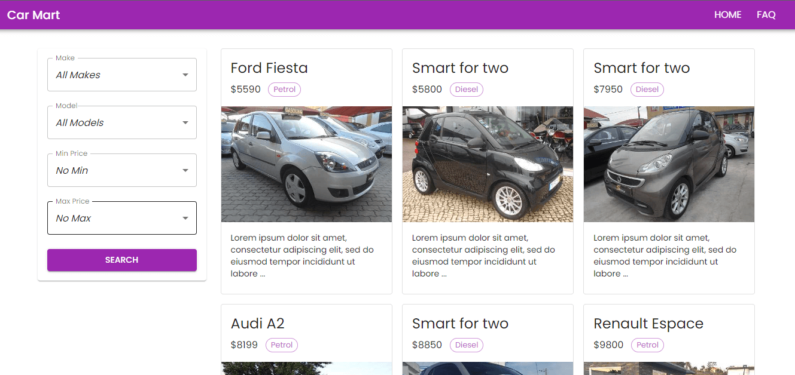

## Car Mart Web Application (Next.JS)
This is an web application developed in Next.JS where people can search cars based on different types of filtering options. The goal of this project is to utilize many latest technologies that super charged any Next.JS application. 

### Technologies Used in this Project
- Next.Js
  - getServerSideProps
  - getStaticProps
  - API routes
- MongoDB Database as data source
- Prisma ORM for query data
- TypeScript for type safe development experience
- Material UI for User Interface design